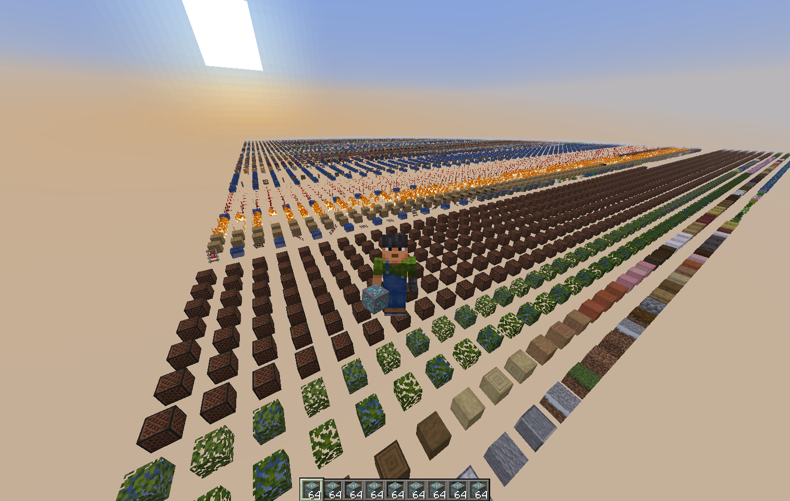

# shulkr

Yet another high-performance Minecraft server library written in Rust.


## Goals

- High-performance
- Lightweight
- Easy to use


## Usage

The project is still very experimental so you would need to add it as a git dependency.
To add it to you project add the following line in your `Cargo.toml`:
```
shulkr = { git = "https://github.com/garfxld/shulkr.git" }
```

You can use one of the examples to quick-start a project.


## Examples

There are some simple (and maybe not fully functional) examples in the [examples](./crates/shulkr/examples/) directory in the `shulkr` crate.

### List of Examples

- [debug_world.rs](./crates/shulkr/examples/debug_world.rs)
- [flat_world.rs](./crates/shulkr/examples/flat_world.rs)
- [inventory.rs](./crates/shulkr/examples/inventory.rs)
- [npc.rs](./crates/shulkr/examples/npc.rs)
- [text.rs](./crates/shulkr/examples/text.rs)


### Running

```sh
cargo r --example debug_world
```

```rust
fn main() {
    let server = Server::new(AuthMode::Online);
    let world = World::new(DimensionType::OVERWORLD);

    let mut states = BlockState::all();
    states.sort_by_key(|s| s.state_id());

    for (pos, block) in states.iter().enumerate() {
        let bz = ((pos / 168) + 1) as i32;
        let bx = ((pos % 168) + 1) as i32;
        world.set_block((bz * 2) - 1, 70, (bx * 2) - 1, *block);
    }

    server
        .events()
        .subscribe(move |event: &mut PlayerConfigEvent| {
            event.set_world(world.clone());
            event.set_position((0.5, 71., 0.5));
        })
        .subscribe(move |event: &mut PlayerSpawnEvent| {
            let player = event.get_player();
            player.set_game_mode(GameMode::Creative);
            player.set_flying(true);
            player.set_permission_level(4);
        })
        .subscribe(|event: &mut PlayerRequestGameModeEvent| {
            event
                .get_player()
                .set_game_mode(event.requested_game_mode());
        });

    server.bind("127.0.0.1:25565").unwrap();
}
```




## Roadmap

- Protocol
    - [x] Server List Ping
    - [x] Encryption
    - [x] Compression
    - [x] Joining a World
    - [x] Registries
    - [ ] All Packets
- World
    - [x] Blocks
    - [ ] Entities
    - [ ] Block Interactions
    - [ ] Light API
    - [ ] Chunk Generation API
    - [ ] Batching
- Entity
    - [ ] Entity API
    - [ ] Entity Metadata ([Issue](https://github.com/garfxld/shulkr/issues/1#issue-5050587525))
- Inventory/Item
    - [x] Open Inventory
    - [x] Close Inventory
    - [x] Set Slot Content
    - [ ] Click Slot
    - [x] Create ItemStack
- [x] Text components (+ MiniMessage)
- [x] Command System
- [x] Event System
- [ ] Resource Pack Support
- [ ] Advancements
- [ ] Proxy Support (WIP, only Velocity)
- [ ] Scoreboards
